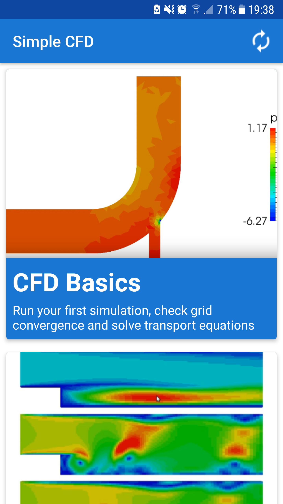
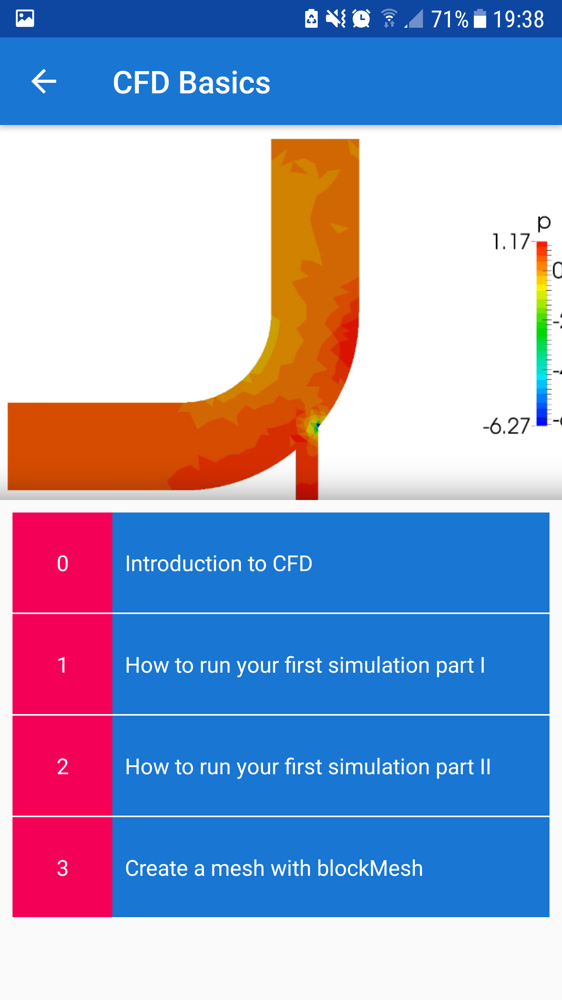
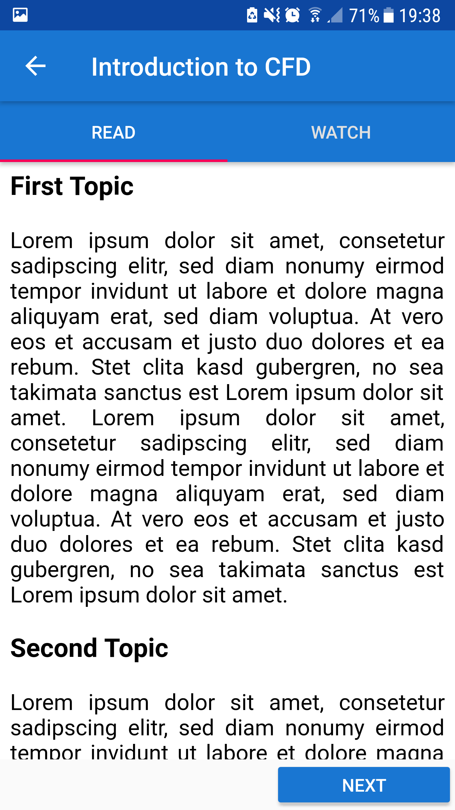
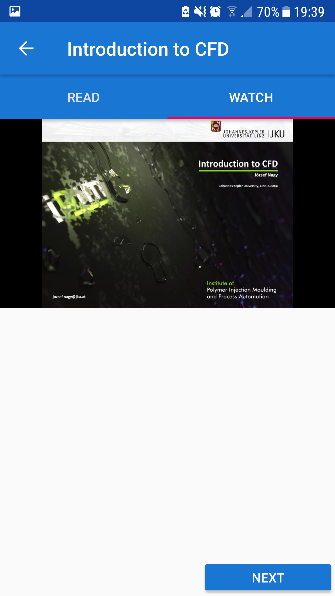

# Final project of the Android Developer Nanodegree

## Simple CFD
Simple CFD is an app to learn computational fluid dynamics (CFD). The document *simple_cfd_project_proposal.pdf* contains further details. Note that this is only a prototype app.

## Files and folders
* \*.png: course topic header images; the images are loaded by the app from the github repository.
* lecture_html.html: lorum ipsm lecture to test the app
* topics_list.json: topic information to create topic objects stored in JSON format; contains, for example, links to images and lectures.
* SimpleCFD: Android Studio project folder; contains the actual app.

## Google service
The app uses google's AdMob to display advertisement at each start of the app and Firebase Analytics to track the popularity of topics.

## Software and libraries
Build with
* Android Studio 3.1
* JRE 1.8.0
* Android Youtube Player API 1.2.2

## License
MIT License

Copyright (c) [2018] [Andre Weiner]

Permission is hereby granted, free of charge, to any person obtaining a copy
of this software and associated documentation files (the "Software"), to deal
in the Software without restriction, including without limitation the rights
to use, copy, modify, merge, publish, distribute, sublicense, and/or sell
copies of the Software, and to permit persons to whom the Software is
furnished to do so, subject to the following conditions:

The above copyright notice and this permission notice shall be included in all
copies or substantial portions of the Software.

THE SOFTWARE IS PROVIDED "AS IS", WITHOUT WARRANTY OF ANY KIND, EXPRESS OR
IMPLIED, INCLUDING BUT NOT LIMITED TO THE WARRANTIES OF MERCHANTABILITY,
FITNESS FOR A PARTICULAR PURPOSE AND NONINFRINGEMENT. IN NO EVENT SHALL THE
AUTHORS OR COPYRIGHT HOLDERS BE LIABLE FOR ANY CLAIM, DAMAGES OR OTHER
LIABILITY, WHETHER IN AN ACTION OF CONTRACT, TORT OR OTHERWISE, ARISING FROM,
OUT OF OR IN CONNECTION WITH THE SOFTWARE OR THE USE OR OTHER DEALINGS IN THE
SOFTWARE.
